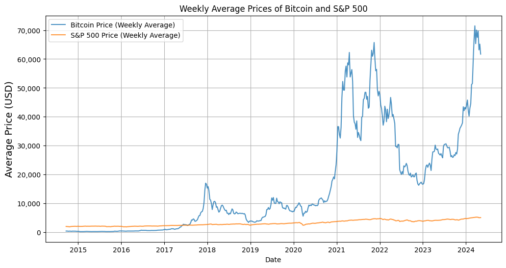

# Is there a significant correlation between Bitcoin prices and other economic indicators, such as the S&P 500?

## What questions are we looking to answer with this proyect? 

The intention for this proyect is to answer these very interesting questions as well as take a look to the behavior of Bitcoin and S&P 500 over the time: 

0. Temporal analysis of Bitcoin (BTC) and S&P 500 over the last 10 years. **(Weekly, Monthly, Annually)**
1. The correlation between Bitcoin and the S&P 500 is higher in periods of economic crisis, is this true?
2. Which Offers Better Returns: Bitcoin's Volatility or the S&P 500's Consistency?
3. Bitcoin shows high volatility compared to the S&P 500, but how volatile is BTC compared to the S&P 500?

By using different techniques such as:

  * Statistics 
  * Analytics
  * Finances 
  * Story Telling
  * Critical thinking

With tools like: 

  * __Python__
  * __Numpy__
  * __Pandas__
  * __Matplotlib__
  * __Seaborn__

I'll answer these very interesting questions, enjoy!

## **Datasets**
### Overview

The datasets include daily prices for Bitcoin and the S&P 500 from **September 2014 to May 2024**.

### Key Preprocessing Steps:

1. **Handling Missing Values**:
   - Removed missing values to ensure data integrity, as they represented less than 1% of the dataset.
2. **Removing Weekend Data**:
   - Aligned Bitcoin's data with the S&P 500, which only trades on business days.
3. **Data Cleaning**:
   - Removed duplicates and ensured temporal alignment between datasets.

## **Project Workflow**

### Step 1 & 2: Initial Investigation
- Performed exploratory analysis using `.head()`, `.info()`, and `.describe()` to understand the datasets.
- Combined relevant files to create unified datasets for Bitcoin and S&P 500 index.
- Ensured high data quality by removing null and duplicate rows.
- Change the data type in columns like 'Date' to `datetime64` for better handling with the datasets.
- By using the Interquartile Range method (IQR) some outliers were found in both datasets, they were keep in order to see market behaviors during extreme events. 
- Data was exported one file for BTC and S&P500 

See the further details in the notebooks for these steps: 
* [Initial Exploration S&P 500](./1_Inital_Exploration_SP_500.ipynb)
* [Initial Exploration BTC](./1_Initial_Exploraion_BTC.ipynb)
* [BTC and S&P Comparation](./2_BTC_SP500_Comparation.ipynb)

### Step 3: Quality Evaluation

- Verified data integrity by checking for **missing values**, **duplicates**, and **logical value ranges**.
- Datasets are temporally, ensuring both had identical date ranges.
- Data is clean and it is consisten and reliable in both datasets.

See the further **observations** and **conclusions** in the notebook:
* [Quality Evaluation for BTC and S&P 500](./3_Quality_Evaluation_BTC_SP500.ipynb)

### Step 4: Temporal Analysis

- **Objective**: Identify price trends over weekly, monthly, quarterly, and yearly intervals.

- **Findings**:
  - **Price Trends**:
    - Bitcoin shows high short-term variability, while the S&P 500 has stable, consistent growth. **(See [Figure 1](#figure-1))**
    - Long-term trends highlight Bitcoin's exponential growth and volatility. **(See [Figure 2](#figure-2))**
  - **Volume Trends**:
    - Bitcoin's transaction volume correlates with periods de high price volatility, often spiking during market rallies or crashes. 
    - The S&P 500's transaction volume remains relatively stable, aligning with its consistent growth.
    - Significant volume surges in Bitcoin often precede price reversals, suggesting a strong relationship between market sentiment and trading activity. **(See [Figure 3](#figure-3) and [Figure 4](#figure-4))**
  - **Comparative Insights**:
    - Bitcoin's volume is highly responsive to market news and macroeconomic events, amplifying its volatility.
    - S&P 500's trading volume shows resilience and lower sensitivity to short-term news, indicating a mature and stable market structure.
    - In both cases in January 2018 price and volume of bitcoin surpassed S&P's metrics, and has stayed like that since then, for the moment... **(See Figure 1 and 3)** 

---

### **Simple Words**:
  - Bitcoin 🪙 exhibits high volatility and exponential long-term growth 📈, with transaction volumes spiking significantly during market events 📊, while the S&P 500 remains stable and less sensitive to short-term changes 🛠️📉. **Since 2018, Bitcoin has consistently outperformed the S&P 500 in both price 💸 and volume 🔥**.

See the further **observations** and **conclusions** in the notebook:
* [Temporal Analysis for Bitcoin and S&P 500 Index](/4_Temporal_Analysis.ipynb)

**Figure 1.** Average Weekly Prices of BTC and S&P 500 (USD). [⬆️ Go back](#temporal-analysis)

**Figure 3.** Weekly Volume Transaction of BTC and S&P 500 (per 1 millon units). [⬆️ Go back](#temporal-analysis)

**Monthly Averages.** Average Monthly Prices of BTC and S&P 500 (USD). [⬆️ Go back](#temporal-analysis)

**Monthly Volum.** Volume Monthly Prices of BTC and S&P 500 (USD). [⬆️ Go back](#temporal-analysis)

**Figure 2.** Average Annual Prices of BTC and S&P 500 (USD). [⬆️ Go back](#temporal-analysis)

**Figure 4.** Annual Volume Transaction of BTC and S&P 500 (per 1 millon units). [⬆️ Go back](#temporal-analysis)

# The correlation between Bitcoin and the S&P 500 is higher in periods of economic crisis, is this true?

### Insights Analysis (Step 5.1):

- **Objective**: The objective of this analysis was to explore the correlation between Bitcoin (BTC) and the S&P 500 Index during the COVID-19 crisis (March 2020 to December 2021), energy and supplies crisis (2021-2022), financial crisis (2023-2024).

- **Specifically, the analysis focuses on**:
  - Understanding the behavior of BTC and the S&P 500 during key economic periods.
  - Comparing price and volume trends and correlations to identify potential patterns or anomalies.
  - Highlighting insights that could inform investment or risk management strategies.

#### Understanding Correlations

  1. **Positive Correlation**:
    - If the correlation is closer to **1**, it indicates a **direct positive correlation**, meaning that as one variable increases, the other also increases.

  2. **Negative Correlation**:
    - If the correlation is closer to **-1**, it indicates a **direct inverse correlation**, meaning that as one variable increases, the other decreases.

  3. **No Correlation**:
    - The closer the correlation is to **0**, the weaker the relationship, indicating **little to no correlation** between the two variables.

### Observations and Conclusions

1. **Overall Trends**:
   - BTC and the S&P 500 exhibit distinct behaviors, with BTC showing higher volatility compared to the stable movement of the S&P 500.
   - Both assets show significant price movements during major economic periods, such as the COVID-19 crisis.

2. **COVID-19 Period Analysis (2020–2021)**:
   - During the pandemic, BTC experienced a sharp price increase **starting late 2020, coinciding with fiscal stimulus measures.** **(See [Figure 5, upper section](#figure-5))**
   - The S&P 500 also rebounded during this period, reflecting similar recovery trends in traditional and cryptocurrency markets.
   - **Correlation Insight**: BTC and S&P 500 demonstrated **moderate-to-strong (0.87)** positive correlation during this period, indicating closer alignment of market movements. **(See [Figure 5, lower section](#figure-5))**

3. **Supply and Energy Crisis 2021–2022 (Still covid issues and Ukraine-Russia War)**:
   - BTC's price and volume exhibited high volatility, with significant declines during global energy shortages and supply chain disruptions, along with the ban of Bitcoin in China (Sep 2021) **(See [Figure 6, upper section](#figure-6))** 
   - The S&P 500 showed relatively stable trends, highlighting resilience compared to BTC's heightened sensitivity to global market conditions.
   - **Correlation Insight**: The correlation between BTC and the S&P 500 **slightly weakened (0.60)** during this period but remained positive, suggesting partial market alignment amidst external shocks. **(See [Figure 6, lower section](#figure-6))** 

4. **Economic Crisis (2023–2024)**:
   - BTC demonstrated significant growth and maintained a higher price trajectory, reflecting increased interest from speculative investors seeking alternative assets. **(See [Figure 7, upper section](#figure-7))**
   - The S&P 500 displayed stable trends with gradual recovery, **reinforcing its role as an indicator of economic stability.**
   - **Correlation Insight**: Correlation **strengthened (0.90)** during this period, indicating **increasing interdependence between BTC and traditional markets** as BTC becomes more integrated into global finance. **(See [Figure 7, lower section](#figure-7))**

5. **Volume Analysis**:
   - BTC trading volume surged during periods of high price volatility, showing sensitivity to market events.
   - S&P 500 volumes, though less volatile, also increased during market uncertainty.
   - Overall, seems like the correlation "volumen trading-price" between bitcoin and S&P 500 is **Not very strong** and they are barely correlated. **(See [Figure 8](#figure-8))**

### The "Red Shadow" in Correlation Graphs

The **red shadow** in the correlation graphs represents the **confidence interval** for the linear regression line. This interval indicates the range within which the true regression line is likely to fall with a certain level of confidence (typically 95%). **A narrower red shadow** suggests **higher confidence** and less variability in the data, while a **wider shadow** indicates **greater uncertainty and variability** in the relationship between BTC and the S&P 500 prices.

These observations and graphical insights collectively highlight how BTC and the S&P 500 respond under various economic conditions, demonstrating distinct behaviors and evolving correlations over time.

---

### **Simple Words**:
- **📊 So, is the correlation between Bitcoin and the S&P 500 higher during periods of economic crisis?**
  - ✅ Yes! It seems that the correlation between Bitcoin 🪙 and the S&P 500 💰 appears to be high 📈, especially during times of economic crises 🔥🌎📉.

See the further **observations** and **conclusions** in the notebook:
* [Analysis For Different Crisis and Correlations](/5.1_Insights_Analysis_Crisis_And_Correlations.ipynb)

**Figure 5.** Bitcoin and S&P Prices During Covid-19 Crisis (USD Price). [⬆️ Go back](#covid-19_correlation)

**Figure 6.** Bitcoin and S&P Prices During Supply and Energy Crisis (USD Price). [⬆️ Go back](#supply_energy_correlation)

**Figure 7.** Economic Crisis 2023-2024 (USD Price). [⬆️ Go back](#Economic-crisis)

**Figure 8.** Volumen-Price BTC vs S&P 500 Correlation. [⬆️ Go back](#volumen-analysis)

# Bitcoin shows high volatility compared to the S&P 500, but how volatile is BTC compared to the S&P 500?
## Analyzing Volatility on Monthly and Yearly Scales

### Insights Analysis (Step 5.2)

- **Objectives:**
  - Evaluate and compare the **volatility** of Bitcoin (BTC) and the S&P 500 Index on different time scales: **monthly** and **annually**.
  - Analyze and highlight:
    - **Average Volatility**: Identifying typical market fluctuations.
    - **Peak Volatility**: Assessing extreme market movements.
    - **Significant differences** and **patterns** in volatility between BTC and the S&P 500 over time.
  - Identify key events influencing the volatility of both assets.
  - Provide a comprehensive understanding of market behavior and associated risks.

### Observations and Conclusions:

#### Key Observations:
1. **Higher Volatility in Bitcoin**:
  - Bitcoin's average monthly volatility is approximately **4.26 times higher** **(See [Figure 9](#figure-9))** than that of the S&P 500.
  - **At its peak**, Bitcoin was **1.74 times** more volatile than the S&P 500's peak monthly volatility, indicating that even during extreme market conditions, Bitcoin exhibits greater risk.
  - Bitcoin is **4.23 times** more volatile than the S&P 500 on average **(annually)**. **(See [Figure 10](#figure-10))**
  - **At its peak**, Bitcoin was **2.68 times** more volatile than the S&P 500 **(annually)**.

2. **Consistent Volatility Patterns**:
   - Bitcoin consistently exhibits significantly higher volatility across both monthly and annual analyses.
   - **(See [Figure 11](#figure-11) and [Figure 12](#figure-12))**

3. **Key Events Influencing Volatility**: **(See [Figure 11](#figure-11))**
   - **COVID-19 Crash (2020)**: Sharp increases in Bitcoin's volatility.
   - **Institutional Adoption (late 2020)**: Maximum volatility observed.
   - **Regulatory Changes (2023)**: Further fluctuations, though reduced compared to earlier years.

#### Conclusions:

1. **Bitcoin as a High-Risk Asset**:
   - Bitcoin's volatility significantly surpasses that of the S&P 500, reaffirming its status as a high-risk asset.

2. **Market Sensitivity to External Events**:
   - Both Bitcoin and the S&P 500 exhibit sensitivity to macroeconomic and regulatory events, but Bitcoin's responses are more pronounced.

3. **Potential for Diversification**:
   - Despite its volatility, Bitcoin could provide diversification benefits in portfolios, particularly for high-risk, high-reward strategies.

4. **Future Implications**:
   - As institutional adoption and regulation evolve, Bitcoin's volatility may stabilize over time, though it is likely to remain higher than traditional indices like the S&P 500.

---

### **Simple Words**
- **how volatile is Bitcoin compared to the S&P 500?**
  - 🪙 Bitcoin exhibits significantly higher 📈 volatility than the S&P 500 in almost every metric evaluated! This is especially true during extreme events, confirming its speculative nature and high-risk profile.
  - With a **montly** average for **4 times** more than S&P 500 and pretty much **the same volatility annually**. 

See the further **observations** and **conclusions** in the notebook:
* [Analysis For Volatility](/5.2_Insights_Volatility_Monthly_Yearly.ipynb)

**Figure 9.** Average Monthly Volatility BTC vs S&P 500. [⬆️ Go back](#volatility-monthly)

**Figure 10.** Average Annually Volatility BTC vs S&P 500. [⬆️ Go back](#volatility-monthly)

**Figure 11.** Monthly Volatility Comparison BTC vs S&P 500. [⬆️ Go back](#volatility-monthly)

**Figure 12.** Annual Volatility Comparison BTC vs S&P 500. [⬆️ Go back](#volatility-monthly)

# Which Offers Better Returns: Bitcoin's Volatility or the S&P 500's Consistency?

### Key Observations
1. **Returns Over Different Timeframes**:
   - Bitcoin demonstrated significantly higher annual, quarterly, monthly, and weekly returns compared to the S&P 500, albeit with higher volatility.**(See [Figure 13](#figure-13), [Figure 14](#figure-14), [Figure 15](#figure-15), [Figure 16](#figure-16))**
   - For example:
     - In 2017, Bitcoin's annual return was approximately 1300%, highlighting its explosive growth during bull markets.

2. **Average Profits**:
   - This is another interesting finding, the average returns for **BTC** and **S&P 500**:
   - **Weekly Average**: Bitcoin 0.62% vs. S&P 500 0.23%
   - **Monthly Average**: Bitcoin 6.42% vs. S&P 500 0.83%
   - **Quarterly Average**: Bitcoin 28.45% vs. S&P 500 3.03%
   - **Annual Average**: Bitcoin 224.01% vs. S&P 500 11.85%

   > **Note**: The year 2017 is a notable outlier that significantly affects Bitcoin's annual average profits.

3. **Risk-Reward Tradeoff**:
   - Despite its volatility, Bitcoin consistently outperformed the S&P 500 in most metrics, making it an **attractive option for risk-tolerant investors**.

### Observations and Conclusions
1. **Performance Analysis**:
   - Bitcoin's returns are extraordinary in bull markets, while the S&P 500 provides steady returns over time.
   - The risk associated with Bitcoin's volatility is offset by its high potential for substantial gains.

2. **Diversification Opportunities**:
   - Incorporating both assets into a portfolio allows for balancing high returns from Bitcoin with the stability of the S&P 500.

3. **Insights for Stakeholders**:
   - Investors seeking long-term stability may prefer the S&P 500.
   - High-risk investors looking for exponential returns might benefit from Bitcoin.

---

### Simple Words
- Bitcoin 📈 offers massive potential gains, but it’s volatile 💥 and risky.
- The S&P 500 📊 is a reliable choice for those who prefer steady and consistent growth 💼.
- Combining these two could offer a balanced investment strategy: high returns with stability 🌎.

**Figure 13.** Annual Returns Over Time. [⬆️ Go back](#Returns-Time)

#### e.g. If you invested X amount in January 2017 and then you withdraw you money at the end of December 2017, you would have had a profit of 1300%

**Figure 14.** Quarterly Returns Over Time. [⬆️ Go back](#Returns-Time)

#### e.g. If you invested X amount in January 2017 and then you withdraw you money on March 2017, you would have had a profit of ~120%

**Figure 15.** Monthly Returns Over Time. [⬆️ Go back](#Returns-Time)

#### e.g. If you invested X amount in January 03 2017 and then you withdraw you money on January 31st 2017, you would have had a profit of ~20%

**Figure 16.** Weekly Returns Over Time. [⬆️ Go back](#Returns-Time)

#### Here it basically shows that would loss money in the first week of 2017 (actually ~10% of loss)

See the further **observations** and **conclusions** in the notebook:
* [Analysis For Returns](/5.3_Inshights_Cumulative_Returns.ipynb)

--- 

# Key Takeaways for Stakeholders

1. **Crisis Period Correlations**  
   - Bitcoin and the S&P 500 show stronger correlations during periods of economic crisis, such as the COVID-19 pandemic and the 2023 financial crisis, with a peak correlation of **0.90**. This suggests Bitcoin's increasing alignment with traditional markets under global economic stress.

2. **Volatility and Risk**  
   - Bitcoin's average volatility is **4.26 times higher** than the S&P 500 monthly and **4.23 times higher** annually, making it a high-risk asset. However, this volatility also creates opportunities for significant returns in bull markets.

3. **Superior Returns**  
   - Bitcoin consistently outperforms the S&P 500 across all timeframes (weekly, monthly, quarterly, and annually). For example, Bitcoin's average annual return is **224%**, compared to **11.85%** for the S&P 500.

4. **Market Sensitivity**  
   - Bitcoin is highly reactive to global events and regulatory changes, with transaction volumes spiking during market shocks. This contrasts with the S&P 500's more stable trading behavior, highlighting Bitcoin’s speculative nature.

5. **Investment Strategies**  
   - Combining Bitcoin's high-growth potential with the S&P 500's stability can balance risk and reward in portfolios. While Bitcoin suits high-risk investors, the S&P 500 remains ideal for those seeking steady, consistent growth.

---

Made with love 💚 by Angel Hackerman 🥷🏻💻 and several AI machines 🤖. Thank for your time 🤗